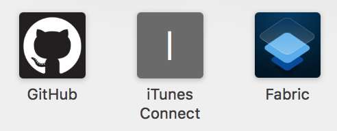
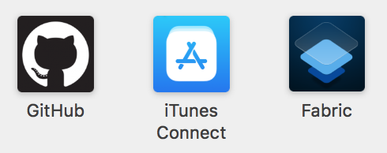

# iTunesConnect-icon
Script that adds an apple-touch-icon for iTunes Connect to Safari's Icon Cache

### Before 😢


### After `itc-icon` 😍


## Running `itc-icon`

You can download and run the `itc-icon` script by pasting this into your terminal:

```you
echo "Downloading..." && curl -sL https://github.com/calda/iTunesConnect-icon/raw/master/itc-icon --output itc-icon && echo "Need sudo to execute script (sudo chmod 777 itc-icon && itc-icon):" && sudo chmod 777 itc-icon && ./itc-icon
```

_Expanded script:_
```
echo "Downloading..." 
curl -sL https://github.com/calda/iTunesConnect-icon/raw/master/itc-icon --output itc-icon
echo "Need sudo to execute script (sudo chmod 777 itc-icon && itc-icon):"
sudo chmod 777 itc-icon
./itc-icon
```

If you want to compile it from source yourself (`main.swift`), just download and run the Xcode project.
